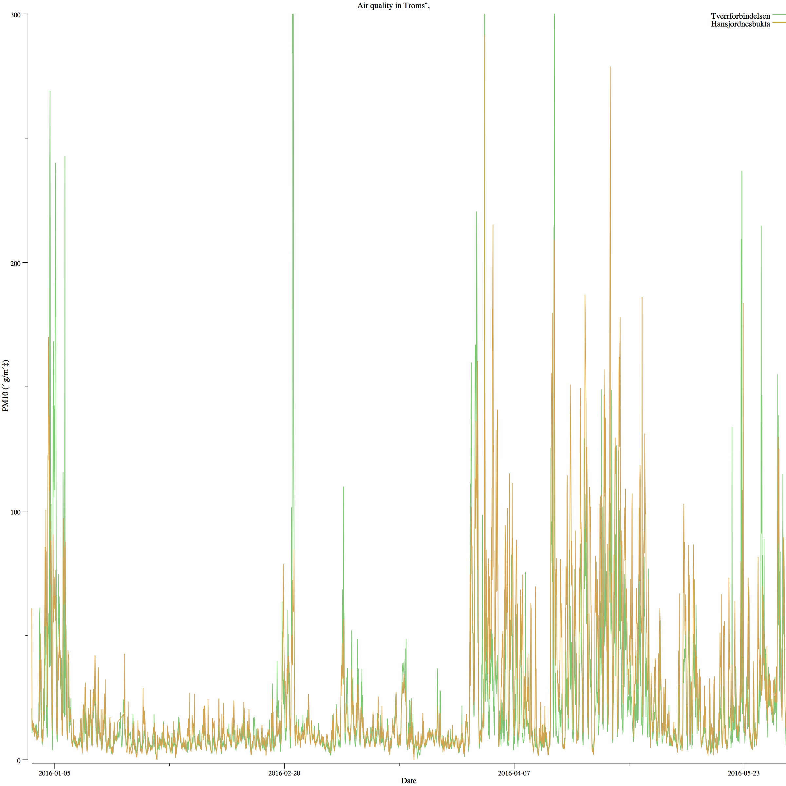
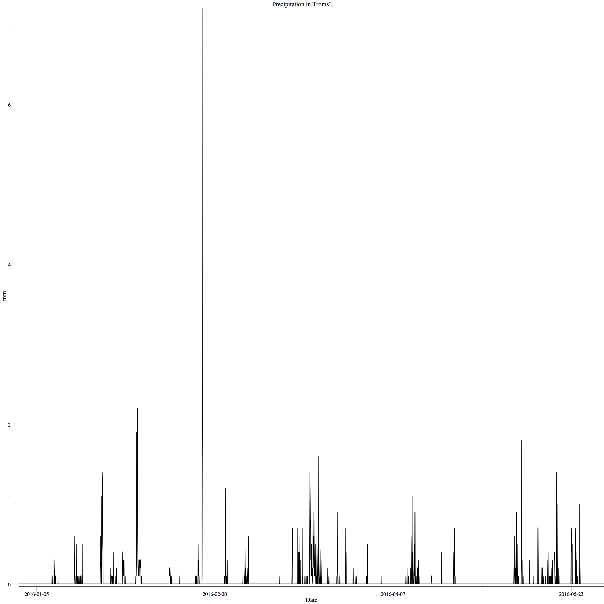

# gonum-plot-example
Trying out [gonum](https://github.com/gonum/plot)'s plotting functionality. 

PM10 measurements for Tromsø 01.01.2016 to 01.06.2016 (data from the
[luftkvalitet](http://github.com/fjukstad/luftkvalitet) package). 

Precipitation in Tromsø 01.01.2016 to 01.06.2016  (data from the
[met](http://github.com/fjukstad/met) package). 

